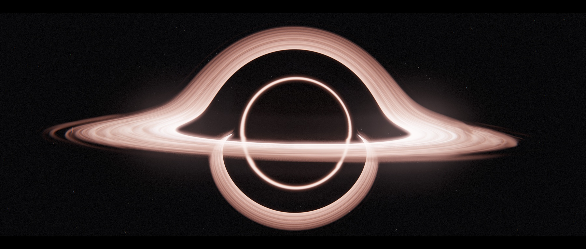
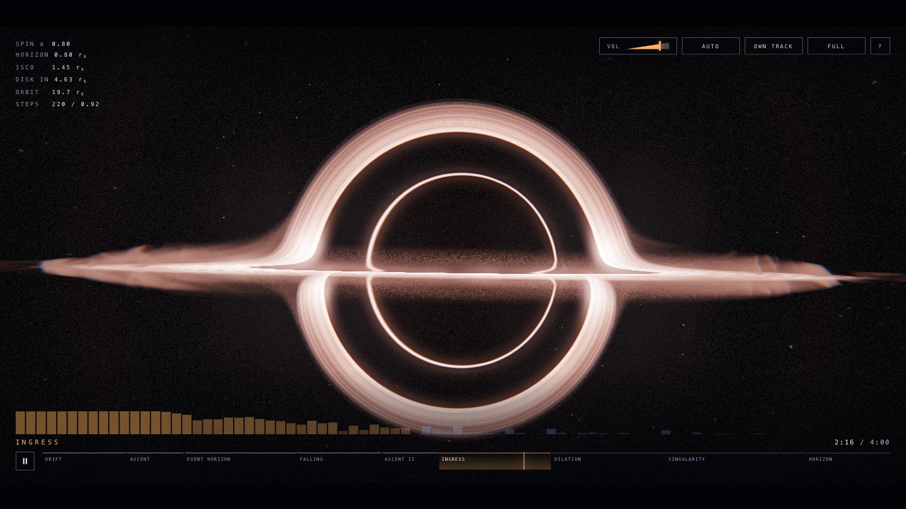

<div align="center">

  <h1>KERR</h1>

  <p><strong>A relativistic black hole, rendered by tracing light through curved spacetime.</strong></p>
  <p>Scored by a cinematic piece that is generated live in your browser — no audio file is ever downloaded.</p>

  <p><a href="https://kerr.cloakyard.com/">kerr.cloakyard.com</a></p>

  <p>
    <a href="https://opensource.org/licenses/MIT"></a>
    
    
    
  </p>

</div>

<p align="center">
  
</p>

---

## ✨ What it is

A single page that draws a spinning black hole the way light actually arrives at a camera near one, and plays a four-minute piece written for it. Everything is computed at runtime — no video, no texture, no audio asset.

- **🌀 Geodesic raymarching** — every pixel integrates a null geodesic through Schwarzschild spacetime with an adaptive midpoint scheme. The photon ring, the Einstein ring and the disk's over-and-under lensed images are not drawn; they are what the integrator produces.
- **🔥 A disk built to _Interstellar_'s own numbers** — DNEG's geometry (`r = 9.26M` to `18.70M`, `a/M = 0.6`), Thorne's position-independent 4500 K, Keplerian shear, and front-to-back opacity so the disk occludes its own far side. One fixed chroma measured off the film's published render, not a temperature ramp.
- **🎼 A live score** — pipe organ, strings, choir formants, a bell arpeggio, timpani and a clock tick, sequenced through ten sections in D minor by a Web Audio graph of oscillators and filters. Intensity is one continuous curve across the four minutes, so sections hand over instead of restarting.
- **🎚️ Three output voicings, picked for you** — the same performance re-mixed for built-in speakers, powered monitors or headphones, chosen automatically and overridable in one tap. A real signal-path change, not a preset name.
- **🎧 Bring your own audio** — drop any file on the page and the visualiser drives itself from an FFT and onset detector instead.
- **📲 Installable, and it works on a plane** — install it and the whole thing runs offline, because "the whole thing" is one document with no runtime assets to miss.

---

## 🌌 Why "Kerr"

Einstein published his field equations in 1915, and Schwarzschild solved them for a non-rotating mass within months, from a trench on the Russian front. Then the problem stalled for forty-seven years: rotation breaks spherical symmetry, and the spinning case resisted everyone who tried it.

Roy Kerr found it in 1963 — barely two pages in *Physical Review Letters*, giving the exact geometry around a spinning mass. It matters because black holes form from collapsing stars, stars rotate, and angular momentum is conserved all the way down: essentially every black hole is a Kerr black hole, and Schwarzschild's is the special case that never quite occurs.

Everything here that makes the image more than a black circle comes from that solution — the horizon shrinking as spin rises, the innermost stable orbit migrating from `6M` toward `M`, and frame dragging, where spacetime is hauled around with the hole. Gargantua is one too: Thorne set its spin just shy of maximal, which is the only reason an hour on Miller's planet costs seven years back home.

---

## 🔭 The physics

Distances are in Schwarzschild radii (`r_s = 1`, so `M = 0.5`). The HUD reports the live state of the simulation.

| Quantity | Behaviour |
| --- | --- |
| Null geodesics | `a = −1.5 h² r⃗ / r⁵`, integrated with adaptive-step RK2. Step size falls out of local curvature, so rays crawl around the photon sphere and stride across flat space. |
| Frame dragging | A gravitomagnetic Lense–Thirring term, `a += a_spin · (v⃗ × B⃗_g)`, falling off as `1/r⁴`. |
| Horizon | `r_h = M + √(M² − a²)` — shrinks as spin rises. |
| ISCO | The full Kerr expression, `6M` at `a = 0` falling toward `M` as `a → 1`. |
| Photon sphere | `1.5 r_s` at zero spin, moving inward for a prograde orbit. |
| Doppler | `δ = 1 / (γ(1 − β·n̂))`. Physically `I_obs ∝ δ³`; the exponent here runs at 0.15, so beaming is present but ±6%. |
| Redshift | `√(1 − 1/r)`, folded into the same shift factor. |
| Disk | `r = 9.26M … 18.70M`, one temperature throughout, exactly as specified for the film. |
| Disk particles | Precessing ellipses driven by the relativistic epicyclic frequency `κ = ω√(1 − 6M/r)`, on a slow inspiral. |

**Where it departs, and why.** DNEG implemented the Doppler asymmetry correctly for _Interstellar_, then removed it: at `I ∝ δ³` the two sides differ by roughly fifty times, giving one blindingly bright edge that reads as a mistake with the shadow lost inside it. The spin is the same compromise, and the reason the two figures above disagree — Gargantua needs `a/M ≈ 1` for the film's time dilation, but at that spin the shadow goes lopsided and its left edge flattens, so it was slowed to `0.6` for the camera. Frame dragging is kept light for the same reason: it is a perturbation on a Schwarzschild marcher, and pushed hard it cuts a notch out of the silhouette instead of smoothly flattening it.

**Where the colour comes from.** Not a black-body curve. Thorne specified a disk that has stopped accreting and cooled to one temperature everywhere, so its colour cannot vary with radius. Inverting this renderer's tone curve on Figure 15a of the DNEG paper gives the linear emission behind each pixel, and from the faintest outer wisp to the core it returns a near-constant `(1.00, 0.48, 0.40)`. The white-hot centre and the salmon fringe are one colour at two intensities; the walk to white is the tone curve and the veiling flare doing their jobs. Ramping hue with radius is what makes a render of Gargantua come out khaki instead of rose.

**Why the outer disk is a volume.** An infinitely thin plane has a tell you cannot texture your way out of: its silhouette is exactly a plane, so the edge comes out glassy however good the map on it. The film's filaments stand off the mid-plane with dark lanes between them, which came from DNGR's volumetric model — ~17 million Houdini voxels of optical density, integrated along the beam. So this disk is a real volume too: a slab of fbm density the marcher integrates, emissive and absorbing both, because those dark lanes are filaments in front of brighter ones and that only happens if the material occludes. Three things were measured off the film. Half-thickness is roughly 1 r_s at mid-disk falling to a knife edge at the rim, so `h/r` *falls* with radius, where a constant flare angle would make it rise and the fringe billow into smoke. Only 56–65% of the vertical span reads as material. And the noise must stay coarse, because a ray grazing the tip runs several r_s through the slab and finer features average away in their own line integral, leaving a solid wall where the film has holes.

**Where the camera goes.** DNEG shot Gargantua from `r_c = 74.1M` and `θ_c = 86.56°` — 3.4° above the disk plane. That grazing angle is what folds the disk's over-and-under images into a closed halo; lift much past ten degrees and the arcs peel apart into an ordinary ringed planet, which is why every framing here sits near the plane. The fields of view are long for the same reason: on the film's plates the shadow spans about an eighth of the frame width, and at a sixteenth the halo, photon ring and ragged rim all shrink below readable size.

**Veiling flare.** A wide, soft, near-neutral glow, run as a second blur chain at an eighth resolution so it can reach a couple of hundred pixels. DNEG convolved their renders with the measured point spread function of the real IMAX lenses so the CG would cut against photographed footage; a tight threshold bloom is no substitute. It stays well below their own flared plate, though, which fills the shadow to pale grey. In the film the shadow reads black.

---

## 🎼 One arc, not ten

Ten sections over 120 bars, and every one used to restart the music: each swelled from its own floor across its own local progress, so all ten crescendoed independently — a build would reach its ceiling and the drop it was building to would begin at 41% of it. Instrumenting the sequencer put a number on it: **all nine section changes stepped backwards, by 25% to 77% of the scheduled energy.**

Intensity is now a property of the piece: each section declares the level it enters and leaves at, `i1` of one *is* `i0` of the next, and every level hangs off that curve. Section changes still change **texture** — a drop brings in organ ranks, choir and the tick an octave up — but not level, and `FALLING` and `HORIZON` still fall, from wherever the previous section left off. Two related fixes went with it: the pads release over exactly their attack time, so consecutive blocks crossfade to a constant instead of dipping; and the melody moved to the absolute bar, which stops it restarting its phrase and — since section starts are not all multiples of eight — sitting over the wrong chord.

---

## 🔊 Three output voicings

The first version of this piece was unlistenable on a laptop. The bass sat around **18 Hz** — inaudible on any built-in speaker, yet loud enough to dominate the waveform, drive the limiter and rattle the drivers.

Small speakers cannot move air below roughly 150 Hz, so the fix is not to boost the bass; it is to synthesise the harmonics of a fundamental the speaker cannot produce and let the ear rebuild the missing tone. Switching voicing re-ramps eleven `AudioParam`s.

| | High-pass | Sub-bass 15–35 Hz | Weight 55–100 Hz | Stereo width | Compression |
| --- | --- | --- | --- | --- | --- |
| **Built-in** | 48 Hz | −37.8 dB | −25.8 dB | 1.00 | most |
| **Speakers** | 33 Hz | −32.5 dB | −30.8 dB | 1.35 | least |
| **Headphones** | 25 Hz | −30.3 dB | −29.3 dB | 0.90 | middle |

Built-in trades sub energy for the harmonics that imply it, and covers laptop and phone drivers alike — both are small, with nothing under ~150 Hz. Speakers assumes a real woofer so the exciter mostly steps aside, but still filters below 33 Hz because feeding a small driver infrasound only costs excursion; it earns the widest image and the least compression. Bass stays mono in all three — only the mid/side stage widens.

### What Auto can and cannot know

Auto is the default, and honest about being a guess. **Exactly one signal decides it: `AudioContext.outputLatency`** — around 10 ms on a built-in output, past 100 ms over a wireless link, with the line drawn at 60 ms. Wireless proves the output is *not* the built-in speaker, but not whether it is earbuds or powered monitors; earbuds are far more common, so that is the guess. `enumerateDevices()` would say more, except it returns one entry with an empty label and id until the page holds a **microphone** permission — and prompting for the mic to choose an EQ curve is not a trade worth making.

So Auto picks **built-in**, switches to **headphones** when the link goes wireless, and never guesses **Speakers**: nothing on the web can spot a KEF LSX II on the end of a cable, so powered monitors stay a deliberate tap. Device class — handheld versus laptop, from UA Client Hints and touch points — is detected too, but it only changes the *wording* of the caption under the buttons, never the voicing; both land on Built-in, which suits small drivers either way.

Two limits. `outputLatency` reads 0 until the AudioContext is running, so the wireless check cannot happen before the first gesture — Auto opens on Built-in and re-voices once there is something to measure. And it only re-checks while Auto is in charge: pick a mode yourself and Auto stands down, the choice is remembered, and a device change will not second-guess it.

---

## 🧰 Tech stack

| Area | Technology |
| --- | --- |
| Rendering | WebGL via [three.js r185](https://threejs.org/) (vendored, tree-shaken) |
| Shading | GLSL — geodesic raymarch, volumetric disk fringe, bloom and veiling flare, ACES tonemap |
| Audio | [Web Audio API](https://developer.mozilla.org/en-US/docs/Web/API/Web_Audio_API) — oscillators, biquads, convolution reverb, waveshaping |
| Build | esbuild, driven by ~350 lines of Node across `scripts/`. No framework. |
| Deployment | [Cloudflare Workers](https://workers.cloudflare.com/) as static assets, at [kerr.cloakyard.com](https://kerr.cloakyard.com/) |

**Why no framework.** One canvas, no routes, no components, no data fetching, nothing in the DOM but a HUD. React would add a runtime and a reconciler to a page whose HUD is already redrawn imperatively sixty times a second — the one shape its model is worst at. Astro solves routing and content, and there is neither. What this needed was module boundaries and a build step, and neither requires a framework.

**The one dependency.** three.js supplies 24 symbols: the renderer, render targets, two cameras, `Points`, some vectors. Everything else is hand-written GLSL. [`src/three-entry.js`](src/three-entry.js) imports exactly those by name and `npm run vendor:three` tree-shakes them into `vendor/three.bundle.js`. Since three ships ESM only, the vendored artefact is a bundle rather than a copied file — and it is **committed and hash-pinned**, so a build never resolves or re-shakes the dependency and `npm run check` can prove the shipped bytes are the pinned ones. [`src/three.js`](src/three.js) is the single seam that reads it.

Colour management is off and the renderer left linear: every shader already ends in an ACES tonemap and a gamma encode, so letting three convert too would apply the transform twice.

---

## 🗂️ How the source is organised

The source is a module tree; the artefact is one self-contained HTML file. Both are deliberate — one document is what makes the CSP enforceable and the page runnable from disk forever, and modules are what make it possible to work on.

```
src/
  index.html           the shell: head, HUD markup, three tags the build fills
  styles.css
  main.js              the composition root, and the frame loop
  three.js             the one seam that reads the vendored bundle
  motion.js            prefers-reduced-motion, read once
  pwa.js               service-worker registration, fire-and-forget
  audio/
    arrangement.js     the score as data, and the intensity curve over it
    engine.js          Web Audio graph, sequencer, analyser
  render/
    shaders/           bh.frag · final.frag · bright.frag · blur.frag · …
    gl.js              context, colour management, float-target detection
    scene.js           every render target and material; the pass chain
    kerr.js            horizon and ISCO, as pure functions
    bh.js              the live state, pushed at the GPU
    quality.js         the adaptive resolution/step policy
    particles.js       the orbiting field
  direct/
    camera.js          section presets, easing, the shot
    events.js          audio events → shockwave, shake, flash, pull
    hud.js             map, telemetry, spectrum, title cards
    output.js          the Auto voicing heuristic, as a pure function
    input.js · shortcuts.js · voicing.js · dropzone.js
```

**Three layers, and the arrows point one way.** `audio/` imports nothing — no DOM, no renderer, no camera. `render/` imports nothing above it. `direct/` composes both, and only `main.js` knows all three. That was already true when this was one file, held together by discipline; `npm run check` and [`test/structure.test.js`](test/structure.test.js) now enforce it, so an import pointing the wrong way fails before it ships.

**The shaders are real files.** `bh.frag` is 375 lines that used to live in a JavaScript template literal, where a stray backtick in a comment would silently truncate the string and kill the page at load. They highlight now, and `#include "noise.glsl"` is resolved at build time. The only honest way to check GLSL is to compile it, which is what the browser test does.

**The arithmetic is kept apart from the machinery.** `kerr.js`, `output.js` and the intensity curve in `arrangement.js` hold no state and touch no uniforms — which is what lets a unit test check the ISCO against Bardeen, Press & Teukolsky, or a section boundary against the one after it, rather than against a screenshot.

---

## 🚀 Getting started

```bash
git clone https://github.com/cloakyard/kerr.git
cd kerr
npm install
npm run dev     # http://localhost:8080
```

A rebuild is about 50 ms, so `npm run dev` feels like editing and reloading — the difference is that development and production run the same builder, so what you are looking at is what ships.

| Command | Description |
| --- | --- |
| `npm run dev` | Rebuild on change, serve on `:8080` |
| `npm run build` | Bundle and inline everything into `dist/index.html` |
| `npm run preview` | Production build, then serve `dist/` |
| `npm run check` | Six static gates — see below |
| `npm test` | 100 tests, including a real browser |
| `npm run deploy` | Check, test, build, publish to Cloudflare |
| `npm run icons` | Re-rasterise the install icons from their SVG sources |
| `npm run vendor:three` | Re-bundle three.js — only needed when bumping it |

Bumping three.js: `npm i -D three@latest`, `npm run vendor:three`, then paste the new hash into `THREE_SHA256` in [`scripts/check.mjs`](scripts/check.mjs) and re-run `npm run check`.

### What gets checked

`npm run check` is the fast gate: the module tree bundles and every `#include` resolves; the vendored three.js matches its pinned hash; every `THREE.*` symbol used is one the vendor entry exports; the built page loads nothing from another origin; the layering holds; every shader resolves to a whole program.

`npm test` needs no dependencies at all — [`node:test`](https://nodejs.org/api/test.html) plus a 300-line DevTools Protocol client ([`test/helpers/browser.mjs`](test/helpers/browser.mjs)) driving whatever Chrome is already on the machine over Node's built-in `WebSocket`. It covers:

| | |
| --- | --- |
| **Arrangement** | 120 bars and exactly four minutes; contiguous sections with types the camera knows; the intensity curve continuous at all nine boundaries; the lead agreeing with its harmony |
| **Kerr geometry** | horizon and ISCO against published values — 6M at `a = 0`, 4.2330M at `a = 0.5`, 2.3209M at `a = 0.9` |
| **Adaptive quality** | never leaves its band under 20,000 random frame rates; settles at both ends; survives `NaN` |
| **Auto voicing** | the iPadOS-presents-as-a-Mac case, and that powered speakers are never guessed |
| **GLSL includes** | diamond and circular includes resolve once, not twice — a duplicate is a redeclaration error |
| **The artefact** | tags balanced, nothing external, shaders present, payload inside budget, README quoting the size the build makes |
| **Structure** | no import cycles, no orphan modules, no dead exports, layering intact |
| **The real page** | boots in headless Chrome under the production headers, asserts zero console errors, then reads pixels out of the WebGL buffer to check the frame is neither black nor the wrong colour |
| **The PWA** | the worker registers, controls the page, reaches the network, and serves the app with the network cut — while the document is still refused a `fetch()` |

The browser tests skip cleanly, with a note, if no Chrome is found.

---

## ☁️ Deploying

```bash
npm run deploy
```

That runs `check`, `test`, `build`, then `wrangler deploy`; [`wrangler.jsonc`](wrangler.jsonc) points at `dist/` and the domain is already configured. It takes about a minute because the tests run first — and they need a Chrome on the machine to be worth anything, since without one you lose the only check that catches a shader failing to compile.

Four things that are only discoverable by trying them:

- **`public/_headers` is honoured.** It began as a Cloudflare Pages feature, but the Workers static-asset runtime reads it too. It is consumed rather than served — requesting `/_headers` gets you the app, not the file.
- **Cloudflare *appends* duplicate headers.** Two `_headers` rules naming the same header both apply, and a browser enforces the intersection. That is why the document's `connect-src` lives in a meta tag — see Privacy.
- **`/index.html` 307s to `/`.** The runtime canonicalises it, and a redirected response cannot be written to the Cache API, so the service worker warms `/` instead.
- **Turn Rocket Loader off** if it is on for the zone. It defers and rewrites inline scripts, and this page is one inline script. Cloudflare's own brotli already handles compression.

The whole deployment is twelve static files: the document, the manifest, the service worker, four PNG icons, three SVGs, the social card, and `_headers`.

---

## 🛡️ Privacy

No server to talk to, no analytics, no cookies, no accounts. Because the build inlines everything, the page can forbid every external origin outright — `default-src 'none'`, and **`connect-src 'none'`, which means it cannot make a network request at all once it has loaded.** That is enforced by the browser, not merely promised.

The concessions are all same-origin or narrower: `media-src blob:` so a dropped audio file can become an object URL (decoded locally, never leaves the device), `img-src 'self'` for the install icons, and `manifest-src`/`worker-src 'self'` for the two files the PWA needs.

<details>
<summary>Why the document's policy is in a meta tag and not only in <code>_headers</code></summary>

Cloudflare **appends** when two `_headers` rules set the same header name, and a browser enforces the *intersection* of every policy it is handed. So a blanket `connect-src 'none'` on `/*` also lands on `/sw.js` — and a service worker under `connect-src 'none'` cannot reach the network at all. That was measured rather than assumed: the worker registered, took control, then answered every request with a 503, which would have broken the second visit for everyone who came back.

So [`_headers`](public/_headers) grants `connect-src 'self'`, which is what the worker needs, and a `<meta http-equiv="Content-Security-Policy">` in the document intersects it back down to `'none'` for the page itself. The meta tag reaches this document and nothing else. `frame-ancestors` stays in the header, the only place it works.

The guarantee is unchanged and still browser-enforced. [`test/pwa.test.js`](test/pwa.test.js) holds down both ends — including an assertion that a `fetch()` from the page is still refused.

</details>

---

## ⚙️ Performance

The whole application is one 603 KB document — **135 KB over the wire** after brotli — served in a single request with no dependency waterfall.

The renderer measures its own frame rate and trades resolution scale against march step count to hold 60 fps, between `0.5×/96` steps and `0.92×/220`. On an M2 Max it sits at the ceiling. `prefers-reduced-motion` damps camera shake, chromatic aberration and flash.

---

## 🎹 Controls

<p align="center">
  
</p>

Live telemetry sits at top left — spin, horizon, ISCO, the disk's inner edge, orbital radius and the adaptive quality the renderer has settled on. Along the bottom, the play control sits with the arrangement map it drives; the map is scrubbable, and its captions drop out as the window narrows rather than colliding.

| | |
| --- | --- |
| Drag | Orbit |
| Scroll / pinch | Fall in and pull back |
| Space | Pause |
| ← → | Skip 10 s |
| ↑ ↓ | Volume |
| `R` | Restart |
| `V` | Cycle voicing: auto / built-in / speakers / headphones |
| `F` | Fullscreen |
| `H` or `?` | Shortcuts |
| Drop a file | Visualise your own audio |

---

## 🙏 Acknowledgements

[**three.js**](https://threejs.org/) does the WebGL heavy lifting — context and state management, render targets, the points pipeline — which leaves the interesting parts free to be hand-written GLSL. It is bundled here under its own MIT license. [**esbuild**](https://esbuild.github.io/) tree-shakes it to only what is used, [**Cloudflare Workers**](https://workers.cloudflare.com/) serves the result, and the score exists at all because the [**Web Audio API**](https://developer.mozilla.org/en-US/docs/Web/API/Web_Audio_API) will happily build a pipe organ out of oscillators and biquad filters.

The physics is borrowed from the people who worked it out:

- **R. P. Kerr**, *Gravitational Field of a Spinning Mass as an Example of Algebraically Special Metrics* — Physical Review Letters **11**, 237. The solution this project is named for.
- **J. M. Bardeen, W. H. Press & S. A. Teukolsky**, *Rotating Black Holes: Locally Nonrotating Frames, Energy Extraction, and Scalar Synchrotron Radiation* — Astrophysical Journal **178**, 347. Source of the ISCO expression used here.
- **O. James, E. von Tunzelmann, P. Franklin & K. S. Thorne**, *Gravitational lensing by spinning black holes in astrophysics, and in the movie Interstellar* — Classical and Quantum Gravity **32**, 065001. The DNEG paper behind Gargantua, and where dropping the Doppler asymmetry is explained.
- **K. S. Thorne**, *The Science of Interstellar*.

---

## 🤝 Contributing & license

Contributions are welcome — see [CONTRIBUTING.md](CONTRIBUTING.md). Licensed under the [MIT License](LICENSE).

<p align="center">Built with ❤️ by <a href="https://github.com/sumitsahoo">Sumit Sahoo</a></p>
