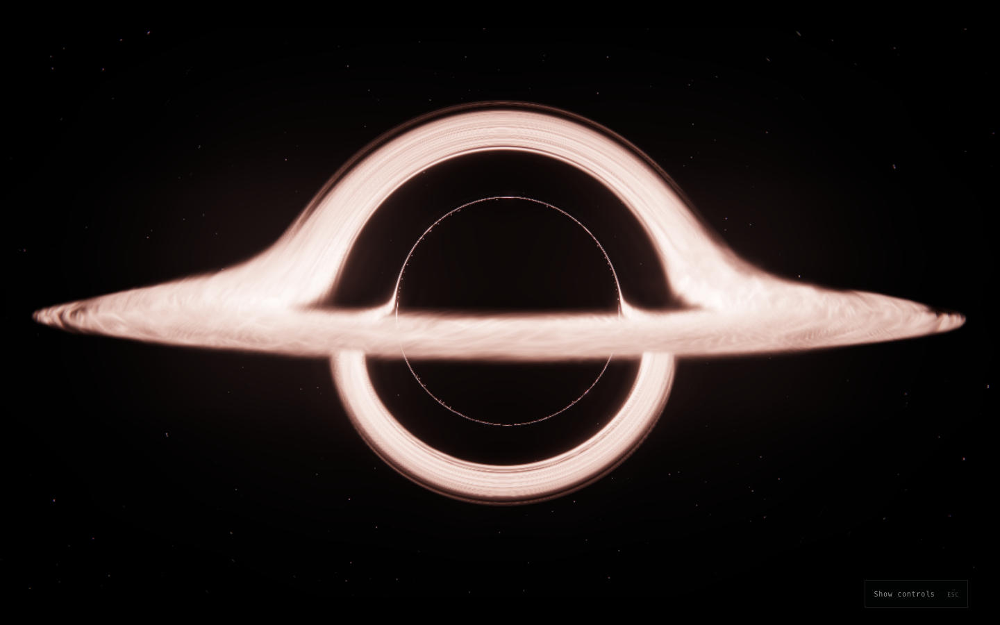
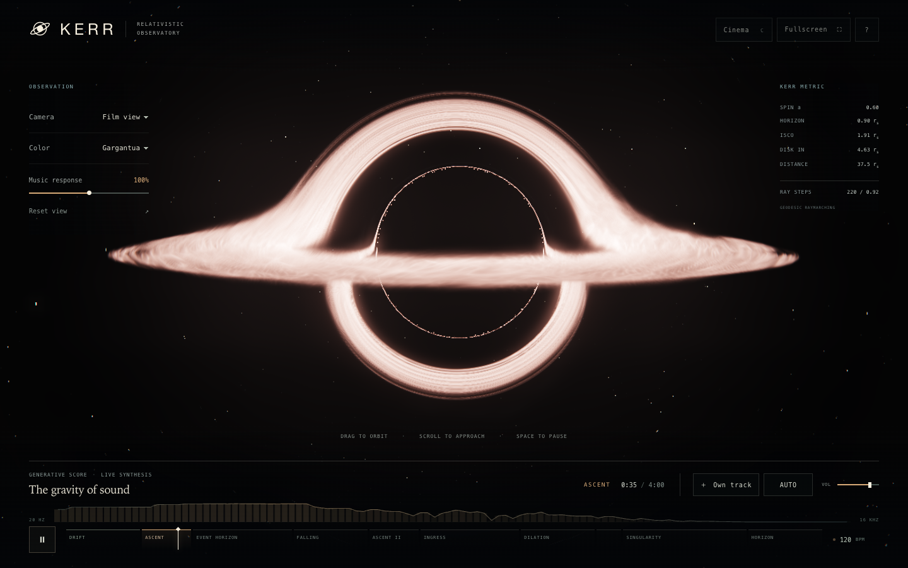
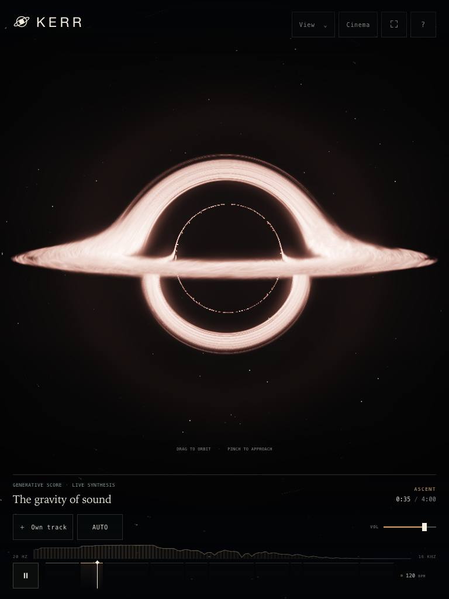
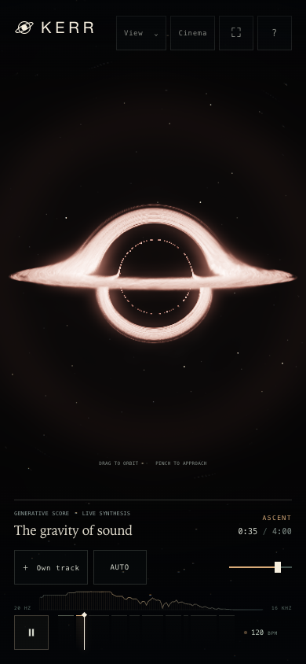

<div align="center">

  <p></p>

  <h1>KERR</h1>

  <p><strong>An artist-directed black hole observatory, with relativistic light bending and a live cinematic score.</strong></p>
  <p>Scored by a cinematic piece that is generated live in your browser — no audio file is ever downloaded.</p>

  <p><a href="https://kerr.cloakyard.com/">kerr.cloakyard.com</a></p>

  <p>
    <a href="https://opensource.org/licenses/MIT"></a>
    
    
    
  </p>

</div>

<p align="center">
  <a href="screenshots/kerr-desktop-cinema.png"></a>
  <br><sub>Cinema · 1440 × 900</sub>
</p>

---

## ✨ What it is

A single page that explores a Gargantua-inspired black hole and plays a four-minute piece written for it. Everything is computed at runtime — no video, no texture, no audio asset. The renderer combines a Schwarzschild-style ray integrator with an approximate spin perturbation and Kerr horizon/ISCO radii; it is a cinematic visualization, not a full Kerr metric solver.

- **🌀 Relativistic raymarching** — an adaptive RK4 integrator bends a single emitting and absorbing disk volume into its over-and-under images. The inner light comes from material encountered along the rays; there is no added photon-ring outline. Finite ray budgets and spin remain approximations.
- **🔥 A structured accretion disk** — DNEG-inspired annulus geometry (`r = 9.26M` to `18.70M`), differential rotation, turbulent dark lanes, and fine filaments throughout an emitting and absorbing volume. Controlled bloom, lens streaks, and a restrained star field shape the glow around the shadow.
- **🎼 A live score** — pipe organ, strings, choir formants, a bell arpeggio, timpani and a clock tick, sequenced through ten sections in D minor by a Web Audio graph of oscillators and filters. Intensity is one continuous curve across the four minutes, so sections hand over instead of restarting.
- **🎚️ Three output voicings** — the same performance re-mixed for built-in speakers, powered monitors or headphones. Auto recognizes clear output labels when available, explains its fallback otherwise, and can be overridden in one tap. A real signal-path change, not a preset name.
- **🎧 Bring your own audio** — choose or drop a supported audio file. Five frequency bands, spectral-flux onset detection, and a confidence-gated tempo estimate drive the scene; return to the original score from the player.
- **🎛️ Direct the experience** — Film, close-passage, oblique, exact edge-on, top-down, and underside views; unrestricted drag through both poles; Gargantua, Ember, and Polar palettes; independent music-response intensity; and a cinema mode with a keyboard-accessible exit.
- **📲 Installable, and it works on a plane** — install it and the whole thing runs offline, because "the whole thing" is one document with no runtime assets to miss.

---

## 🎹 Controls

Observation controls select a camera, color palette and music-response amount. On compact screens, **View** opens these controls when needed. Live telemetry reports the simulated geometry and rendering quality; the bottom player combines a spectrum, tempo, source status and scrubbable timeline. Imported tracks expose a return-to-score button. Cinema mode clears the interface and keeps a visible exit. Help keeps its close button visible while the shortcut list scrolls, then restores focus to the opener.

<p align="center">
  <a href="screenshots/kerr-desktop-interface.png"></a>
  <br><sub>Desktop interface · 1440 × 900</sub>
</p>

<p align="center">
  <a href="screenshots/kerr-tablet-portrait.png"></a>
  <a href="screenshots/kerr-mobile-portrait.png"></a>
  <br><sub>Tablet · 768 × 1024 &nbsp; / &nbsp; Phone · 390 × 844</sub>
</p>

These direct browser captures show **Ascent at 0:35**, using Film view, the Gargantua palette and 100% music response. Open an image for full size. See the [mobile controls](screenshots/kerr-mobile-controls.png), [landscape](screenshots/kerr-mobile-landscape.png) and [small-screen](screenshots/kerr-mobile-small.png) captures, the [responsive review](docs/RESPONSIVE-REVIEW.md), and [capture provenance](screenshots/capture-manifest.json). Tablet and phone views use Chrome viewport/touch emulation.

| | |
| --- | --- |
| Drag | Orbit |
| Scroll / pinch | Fall in and pull back |
| Space | Pause |
| ← → | Skip 10 s |
| ↑ ↓ | Volume |
| `1` / `2` / `3` | Film / close-passage / oblique camera |
| `4` / `5` / `6` | Exact edge-on / top-down / underside camera |
| `C` / `Esc` | Enter / leave cinema mode |
| `X` | Reset view |
| `R` | Restart |
| `V` | Cycle voicing: auto / built-in / speakers / headphones |
| `F` | Fullscreen |
| `H` or `?` | Shortcuts |
| Drop a file | Visualise your own audio |

---

## 🌌 Why "Kerr"

Einstein published his field equations in 1915, and Schwarzschild solved them for a non-rotating mass within months, from a trench on the Russian front. Then the problem stalled for forty-seven years: rotation breaks spherical symmetry, and the spinning case resisted everyone who tried it.

Roy Kerr found it in 1963 — barely two pages in *Physical Review Letters*, giving the exact geometry around a spinning mass. It matters because black holes form from collapsing stars, stars rotate, and angular momentum is conserved all the way down: essentially every black hole is a Kerr black hole, and Schwarzschild's is the special case that never quite occurs.

The project borrows the shrinking horizon and migrating prograde ISCO from that solution. Its light bending uses a simpler Schwarzschild-based model with approximate frame dragging, where rotation perturbs the light's path. The name describes its inspiration and scalar geometry, rather than a claim that the ray shader solves the full rotating metric.

---

## 🔭 The physics

Distances are in Schwarzschild radii (`r_s = 1`, so `M = 0.5`). The HUD reports the renderer's state. The analytical horizon/ISCO calculations are independently tested; those tests do not establish ray-path convergence or full physical accuracy. See the [visual review](docs/VISUAL-REVIEW.md) for the audit and verification criteria.

| Quantity | Behaviour |
| --- | --- |
| Ray integration | `a = −1.5 h² r⃗ / r⁵`, integrated with adaptive-step RK4. Step size follows local curvature and distance to the disk volume; the additional spin term is a perturbation, not a Kerr geodesic equation. |
| Frame dragging | A gravitomagnetic Lense–Thirring term, `a += a_spin · (v⃗ × B⃗_g)`, falling off as `1/r⁴`. |
| Horizon | `r_h = M + √(M² − a²)` — shrinks as spin rises. |
| ISCO | The full Kerr expression, `6M` at `a = 0` falling toward `M` as `a → 1`. |
| Higher-order images | Rays can turn around the hole and encounter the disk again. No screen-space circle is added to stand in for unresolved paths. |
| Doppler and redshift | The shader retains an optional approximate shift factor, but its exponent is zero in the film treatment: frequency shifts and beaming are disabled. |
| Disk | Nominal annulus `r = 9.26M … 18.70M`, with artist-tuned density, thickness and gray emissivity. Its fixed chroma is inspired by the uniform-temperature film disk, rather than derived from thermal radiative transfer. |
| Disk particles | Stylized precessing ellipses using `κ = ω√(1 − 6M/r)`, on a slow inspiral. The separately rendered particles are masked near strongly bent rays rather than individually ray-traced. |

**Where it departs, and why.** DNEG implemented the Doppler asymmetry correctly for _Interstellar_, then removed it: at `I ∝ δ³` the two sides differ by roughly fifty times, giving one blindingly bright edge that reads as a mistake with the shadow lost inside it. The spin is the same compromise, and the reason the two figures above disagree — Gargantua needs `a/M ≈ 1` for the film's time dilation, but at that spin the shadow goes lopsided and its left edge flattens, so it was slowed to `0.6` for the camera. Frame dragging is kept light for the same reason: it is a perturbation on a Schwarzschild marcher, and pushed hard it cuts a notch out of the silhouette instead of smoothly flattening it.

**Where the colour comes from.** The default `(1.00, 0.48, 0.40)` chroma is an artistic match, not a measured spectral model or a recovered production value. The DNEG reference specifies a uniform 4500 K disk, a 6500 K white balance, and the film treatment with frequency shifts omitted. Brightness, tone mapping and flare produce the progression toward white in this renderer; Ember and Polar are creative alternatives. The paper does not support the earlier claim that nonlinear film-layer interactions caused a particular cool highlight color. See the [primary-reference audit](docs/INTERSTELLAR-REFERENCE.md).

**Why the disk is a volume.** A disk rendered only when rays cross its mid-plane disappears for rays traveling exactly within that plane, while an added textured fringe cannot give its face proper depth. The entire disk now emits and absorbs along ray segments, with opacity `1 − exp(−σΔs)` and front-to-back transmittance. Its tapered Gaussian profile, corrugated layers and evolving density produce the same material from above, below and within the plane. Two overlapping material phases renew over 18 simulation seconds, preventing differential shear from winding the texture indefinitely into moiré; the music modulates this material clock. These thickness, density and motion parameters are visual choices; the reference supplies no unique numerical profile. This is a procedural interpretation of DNGR's volume, tuned for a finite browser ray budget rather than a reconstruction of its production data.

**Where the camera goes.** DNEG shot Gargantua from `r_c = 74.1M` and `θ_c = 86.56°` — 3.4° above the disk plane. The Film view begins at that grazing angle, and Close passage also stays near the plane. Oblique, edge-on, top-down and underside views hold fixed angles; the cardinal views land exactly at 0° and ±90°. Drag can pass continuously through both poles. Film and Close passage retain the chosen elevation and resume their gentle orbit after release, so the background stars keep moving; inspection views hold the chosen orientation. Reduced motion keeps automatic drift off. Reset restores the selected preset. The black hole stays at `a/M = 0.6` across the score, so inspecting its geometry is independent of the music. Framing pulls back for portrait screens and makes room beside the introductory copy on wide screens.

**Veiling flare.** A filtered highlight pass eases into bloom around its luminance threshold. Separate half- and quarter-resolution glow preserve fine structures, then an eighth-resolution chain supplies wide, near-neutral optical scatter. Its strength and shape are artist-tuned approximations, with enough contrast to retain the disk structure and central shadow. DNEG used measured IMAX lens point-spread functions; this renderer does not reproduce that calibrated optical model, and its shadow brightness is a grading choice rather than a measured match to a film frame.

**Display finish.** ACES tone mapping and Three's exact sRGB transfer preserve the near-black sky and dark disk lanes. A contrast-aware spatial resolve smooths bright edges before the final display-space grain. It uses the actual scene buffer dimensions as adaptive quality changes, and retains no temporal history that could smear during a drag. Subpixel higher-order images can still remain dotted on small screens; this is antialiasing, not additional ray integration. See the [r186 upgrade and visual review](docs/THREE-R186-REVIEW.md).

---

## 🎼 One arc, not ten

Ten sections over 120 bars, and every one used to restart the music: each swelled from its own floor across its own local progress, so all ten crescendoed independently — a build would reach its ceiling and the drop it was building to would begin at 41% of it. Instrumenting the sequencer put a number on it: **all nine section changes stepped backwards, by 25% to 77% of the scheduled energy.**

Intensity is now a property of the piece: each section declares the level it enters and leaves at, `i1` of one *is* `i0` of the next, and every level hangs off that curve. Section changes still change **texture** — a drop brings in organ ranks, choir and the tick an octave up — but not level, and `FALLING` and `HORIZON` still fall, from wherever the previous section left off. Two related fixes went with it: the pads release over exactly their attack time, so consecutive blocks crossfade to a constant instead of dipping; and the melody moved to the absolute bar, which stops it restarting its phrase and — since section starts are not all multiples of eight — sitting over the wrong chord.

The visual response uses five frequency bands from a 4096-point FFT, with attack and release measured in seconds. A waveform silence gate prevents adaptive normalization from amplifying silence. Spectral flux separates attacks from sustained notes; the built-in score supplies its known pulse while imported tracks get a conservative tempo estimate whose confidence controls the readout. Bass supports disk emission and camera weight, mids change material detail, and highs reveal small highlights. The response slider changes this visual sensitivity independently of listening volume. Seeking and changing sources reset analysis history.

---

## 🔊 Three output voicings

The first version of this piece was unlistenable on a laptop. The bass sat around **18 Hz** — inaudible on any built-in speaker, yet loud enough to dominate the waveform, drive the limiter and rattle the drivers.

Small speakers cannot move air below roughly 150 Hz, so the fix is not to boost the bass; it is to synthesise the harmonics of a fundamental the speaker cannot produce and let the ear rebuild the missing tone. Switching voicing re-ramps eleven `AudioParam`s.

| | High-pass | Sub-bass 15–35 Hz | Weight 55–100 Hz | Stereo width | Compression |
| --- | --- | --- | --- | --- | --- |
| **Built-in** | 48 Hz | −37.8 dB | −25.8 dB | 1.00 | most |
| **Speakers** | 33 Hz | −32.5 dB | −30.8 dB | 1.35 | least |
| **Headphones** | 25 Hz | −30.3 dB | −29.3 dB | 0.90 | middle |

Built-in trades sub energy for the harmonics that imply it, and covers laptop and phone drivers alike — both are small, with nothing under ~150 Hz. Speakers assumes a real woofer so the exciter mostly steps aside, but still filters below 33 Hz because feeding a small driver infrasound only costs excursion; it earns the widest image and the least compression. Bass stays mono in all three — only the mid/side stage widens.

### What Auto can and cannot know

Auto reads output labels already exposed by `enumerateDevices()` and matches only the active `AudioContext.sinkId`, or the system-default entry when the context follows the default. An attached headset is not evidence that it is playing. Clear headphone, built-in speaker and external speaker labels select their respective voicings; generic audio ports, combined speaker/headphone endpoints and unknown model names do not reveal the transducer at the other end.

**Latency does not identify the output.** The old 60 ms rule mislabeled buffered speakers as headphones and missed wired headphones. [`outputLatency` measures delivery delay](https://www.w3.org/TR/webaudio-1.1/#dom-audiocontext-outputlatency), so it no longer selects an EQ curve. When the browser hides the device identity, Auto uses the conservative **Built-in** mix and explicitly says the output type is unavailable. Choose Speakers or Headphones yourself in that case. KERR never requests microphone permission, changes the system output, or saves device names or IDs. Browser permissions and privacy rules limit which [output metadata can be exposed](https://www.w3.org/TR/mediacapture-streams/#dom-mediadevices-enumeratedevices).

Auto refreshes after device changes, context startup/resume, output-sink changes and returning to the page. A two-second check while the page is visible and the context is running catches route changes whose events are delayed or missing. Stale asynchronous results cannot override a newer output or a manual selection, and unchanged results do not restart the audio ramps. A manual choice is remembered and always takes precedence. The intro caption and the live Auto button's tooltip and accessible label explain the current choice.

---

## 🧰 Tech stack

| Area | Technology |
| --- | --- |
| Rendering | WebGL via [three.js r186](https://github.com/mrdoob/three.js/releases/tag/r186) (vendored, tree-shaken) |
| Shading | GLSL — RK4 raymarch, emitting and absorbing disk volume, multiscale bloom, ACES/sRGB and spatial edge resolve |
| Audio | [Web Audio API](https://developer.mozilla.org/en-US/docs/Web/API/Web_Audio_API) — oscillators, biquads, convolution reverb, waveshaping |
| Build | esbuild, driven by ~350 lines of Node across `scripts/`. No framework. |
| Deployment | [Cloudflare Workers](https://workers.cloudflare.com/) as static assets, at [kerr.cloakyard.com](https://kerr.cloakyard.com/) |

**Why no framework.** One canvas, no routes, no components, no data fetching, nothing in the DOM but a HUD. React would add a runtime and a reconciler to a page whose HUD is already redrawn imperatively sixty times a second — the one shape its model is worst at. Astro solves routing and content, and there is neither. What this needed was module boundaries and a build step, and neither requires a framework.

**The one runtime dependency.** three.js supplies 23 symbols: the renderer, render targets, two cameras, `Points`, some vectors. Everything else is hand-written GLSL. [`src/three-entry.js`](src/three-entry.js) imports exactly those by name and `npm run vendor:three` tree-shakes them into `vendor/three.bundle.js`. Since three ships ESM only, the vendored artefact is a bundle rather than a copied file — and it is **committed and hash-pinned**, so a build never resolves or re-shakes the dependency and `npm run check` can prove the shipped bytes are the pinned ones. [`src/three.js`](src/three.js) is the single seam that reads it.

Colour management is off and the renderer left linear: scene, bloom and flare targets contain linear HDR values. Only the compositor applies ACES and Three's sRGB transfer; the final resolve operates on display-encoded pixels. Another renderer-level conversion would apply the transform twice. Fullscreen passes use one triangle, and render targets have no depth buffers.

---

## 🗂️ How the source is organised

The source is a module tree; the artefact is one self-contained HTML file. Both are deliberate — one document is what makes the CSP enforceable and the page runnable from disk forever, and modules are what make it possible to work on.

```
src/
  index.html           the shell: head, HUD markup and build placeholders
  styles.css
  main.js              the composition root, and the frame loop
  three.js             the one seam that reads the vendored bundle
  motion.js            prefers-reduced-motion, read once
  pwa.js               service-worker registration, fire-and-forget
  audio/
    arrangement.js     the score as data, and the intensity curve over it
    engine.js          Web Audio graph, sequencer, analyser
    features.js        frequency envelopes, spectral flux, tempo confidence
  render/
    shaders/           bh.frag · final.frag · bright.frag · blur.frag · …
    gl.js              context, colour management, float-target detection
    scene.js           every render target and material; the pass chain
    kerr.js            horizon and ISCO, as pure functions
    bh.js              the live state, pushed at the GPU
    quality.js         the adaptive resolution/step policy
    particles.js       the orbiting field
  direct/
    camera.js          section presets, easing, the shot
    experience.js      shot, palette, response and cinema controls
    events.js          audio events → shockwave, shake, flash, pull
    hud.js             map, telemetry, spectrum, title cards
    output.js          active-output label classification, as a pure function
    input.js · shortcuts.js · voicing.js · dropzone.js
```

**Three layers, and the arrows point one way.** `audio/` imports nothing — no DOM, no renderer, no camera. `render/` imports nothing above it. `direct/` composes both, and only `main.js` knows all three. That was already true when this was one file, held together by discipline; `npm run check` and [`test/structure.test.js`](test/structure.test.js) now enforce it, so an import pointing the wrong way fails before it ships.

**The shaders are real files.** `bh.frag` used to live in a JavaScript template literal, where a stray backtick in a comment would silently truncate the string and kill the page at load. The shaders highlight now, and `#include "noise.glsl"` is resolved at build time. The browser test compiles the actual GLSL and checks that the page draws.

**The arithmetic is kept apart from the machinery.** `kerr.js`, `output.js` and the intensity curve in `arrangement.js` hold no state and touch no uniforms — which is what lets a unit test check the ISCO against Bardeen, Press & Teukolsky, or a section boundary against the one after it, rather than against a screenshot.

**The official mark.** [`public/logo.svg`](public/logo.svg) is the canonical orbit logo, inlined into the header by the build. Run `npm run icons` after changing it to generate the favicon SVG/PNG, app and maskable SVGs, and their install PNGs, including the Apple touch icon. Generation uses a local Chrome installation with no extra dependencies; set `CHROME_PATH` if needed. Commit the generated assets together; normal builds use those files directly. The dark-tile [`public/favicon.svg`](public/favicon.svg) also supplies the README mark.

---

## 🚀 Getting started

Use **Node.js 22 or newer** (required by Wrangler 4.130). The pinned toolchain is Three.js 0.186.0, esbuild 0.28.2 and Wrangler 4.130.0. A scoped override patches Miniflare's Sharp dependency to 0.35.4; it can be removed once Miniflare pins a patched version itself.

```bash
git clone https://github.com/cloakyard/kerr.git
cd kerr
npm install
npm run dev     # http://localhost:8080
```

A rebuild is about 50 ms, so `npm run dev` feels like editing and reloading — the difference is that development and production run the same builder, so what you are looking at is what ships.

| Command | Description |
| --- | --- |
| `npm run dev` | Rebuild on change, serve on `:8080` |
| `npm run build` | Bundle and inline everything into `dist/index.html` |
| `npm run preview` | Production build, then serve `dist/` |
| `npm run check` | Six static gates — see below |
| `npm test` | Automated regression tests, including a real browser |
| `npm run deploy` | Check, test, build, publish to Cloudflare |
| `npm run icons` | Generate favicon and install SVG/PNG variants from `public/logo.svg` using local Chrome |
| `npm run vendor:three` | Re-bundle three.js — only needed when bumping it |

Bumping three.js: `npm i -D three@latest`, `npm run vendor:three`, then paste the new hash into `THREE_SHA256` in [`scripts/check.mjs`](scripts/check.mjs) and re-run `npm run check`.

### What gets checked

`npm run check` is the fast gate: the module tree bundles and every `#include` resolves; the vendored three.js matches its pinned hash; every `THREE.*` symbol used is one the vendor entry exports; the built page loads nothing from another origin; the layering holds; every shader resolves to a whole program.

`npm test` needs no dependencies at all — [`node:test`](https://nodejs.org/api/test.html) plus a 300-line DevTools Protocol client ([`test/helpers/browser.mjs`](test/helpers/browser.mjs)) driving whatever Chrome is already on the machine over Node's built-in `WebSocket`. It covers:

| | |
| --- | --- |
| **Arrangement** | 120 bars and exactly four minutes; contiguous sections with types the camera knows; the intensity curve continuous at all nine boundaries; the lead agreeing with its harmony |
| **Kerr geometry** | horizon and ISCO against published values — 6M at `a = 0`, 4.2330M at `a = 0.5`, 2.3209M at `a = 0.9` |
| **Adaptive quality** | never leaves its band under 20,000 random frame rates; settles at both ends; survives `NaN` |
| **Auto voicing** | active/default sink matching, wired headphones and external speakers, unknown-output fallback, route changes, async races and manual overrides |
| **Music analysis and transport** | silence, bounded frequency envelopes, time-based smoothing, onset/tempo recovery, source switching, stale request errors and delayed-scheduler recovery |
| **Reduced-motion camera** | stable automatic framing through a loud section, manual shot/zoom access, and a valid portrait camera basis |
| **All-angle camera** | exact cardinal angles, finite orthonormal frames at both poles, continuous full turns, steady inspection views, and resumed cinematic drift after touch release/cancellation |
| **GLSL includes** | diamond and circular includes resolve once; literal smoothstep edges stay in their defined order |
| **GPU postprocessing** | sRGB shadows, HDR headroom, bloom hue and thin-filament stability, diagonal antialiasing, isolated stars, black grain floor and unsigned-byte fallback |
| **Fullscreen** | actual entry/exit state, external exit, keyboard shortcut, compact icons and rejected requests |
| **Interaction recovery** | interrupted timeline gestures stop seeking; selecting the same local file again restarts its import |
| **The artefact** | tags balanced, nothing external, shaders present, payload inside budget, README quoting the size the build makes |
| **Structure** | no import cycles, no orphan modules, no dead exports, layering intact |
| **The real page** | boots under production headers, compiles and draws without errors, checks actual framebuffer pixels, and exercises sensitivity, shortcut isolation and overlay focus |
| **The PWA** | the worker registers, controls the page, reaches the network, and serves the app with the network cut — while the document is still refused a `fetch()` |

The browser tests skip cleanly, with a note, if no Chrome is found.

---

## ☁️ Deploying

```bash
npm run deploy
```

That runs `check`, `test`, `build`, then `wrangler deploy`; [`wrangler.jsonc`](wrangler.jsonc) points at `dist/` and the domain is already configured. The full browser regression suite runs before publishing and needs a local Chrome installation to catch failures such as a shader that does not compile.

Four things that are only discoverable by trying them:

- **`public/_headers` is honoured.** It began as a Cloudflare Pages feature, but the Workers static-asset runtime reads it too. It is consumed rather than served — requesting `/_headers` gets you the app, not the file.
- **Cloudflare *appends* duplicate headers.** Two `_headers` rules naming the same header both apply, and a browser enforces the intersection. That is why the document's `connect-src` lives in a meta tag — see Privacy.
- **`/index.html` 307s to `/`.** The runtime canonicalises it, and a redirected response cannot be written to the Cache API, so the service worker warms `/` instead.
- **Turn Rocket Loader off** if it is on for the zone. It defers and rewrites inline scripts, and this page is one inline script. Cloudflare's own brotli already handles compression.

The deployment contains the document, PWA manifest and service worker, SVG/PNG branding assets, the social card, and `_headers`.

---

## 🛡️ Privacy

No server to talk to, no analytics, no cookies, no accounts. Because the build inlines everything, the page can forbid every external origin outright — `default-src 'none'`, and **`connect-src 'none'`, which means it cannot make a network request at all once it has loaded.** That is enforced by the browser, not merely promised.

The concessions are all same-origin or narrower: `media-src blob:` so a dropped audio file can become an object URL (decoded locally, never leaves the device), `img-src 'self'` for the install icons, and `manifest-src`/`worker-src 'self'` for the two files the PWA needs.

<details>
<summary>Why the document's policy is in a meta tag and not only in <code>_headers</code></summary>

Cloudflare **appends** when two `_headers` rules set the same header name, and a browser enforces the *intersection* of every policy it is handed. So a blanket `connect-src 'none'` on `/*` also lands on `/sw.js` — and a service worker under `connect-src 'none'` cannot reach the network at all. That was measured rather than assumed: the worker registered, took control, then answered every request with a 503, which would have broken the second visit for everyone who came back.

So [`_headers`](public/_headers) grants `connect-src 'self'`, which is what the worker needs, and a `<meta http-equiv="Content-Security-Policy">` in the document intersects it back down to `'none'` for the page itself. The meta tag reaches this document and nothing else. `frame-ancestors` stays in the header, the only place it works.

The guarantee is unchanged and still browser-enforced. [`test/pwa.test.js`](test/pwa.test.js) holds down both ends — including an assertion that a `fetch()` from the page is still refused.

</details>

---

## ⚙️ Performance

The whole application is one 639 KB document — **142 KB over the wire** after brotli — served in a single request with no dependency waterfall.

The renderer measures real elapsed frame time and trades resolution scale against march step count toward a 60 fps target, between `0.5×/96` steps and `0.92×/220`. Achieved frame rate depends on the browser, viewport and GPU; automated SwiftShader tests are correctness checks, not a hardware benchmark. Hidden tabs skip rendering and reset timing when visibility changes.

`prefers-reduced-motion` stops automatic camera orbit, breathing, roll, score-driven shot changes and accumulated material clocks, and disables transient camera effects and chromatic aberration. Manual shot selection and zoom still work. Audio can still change brightness and fine material detail, so this is not a complete static-image mode.

---

## 🙏 Acknowledgements

[**three.js**](https://threejs.org/) does the WebGL heavy lifting — context and state management, render targets, the points pipeline — which leaves the interesting parts free to be hand-written GLSL. It is bundled here under its own MIT license. [**esbuild**](https://esbuild.github.io/) tree-shakes it to only what is used, [**Cloudflare Workers**](https://workers.cloudflare.com/) serves the result, and the score exists at all because the [**Web Audio API**](https://developer.mozilla.org/en-US/docs/Web/API/Web_Audio_API) will happily build a pipe organ out of oscillators and biquad filters.

The physics is borrowed from the people who worked it out:

- **R. P. Kerr**, *Gravitational Field of a Spinning Mass as an Example of Algebraically Special Metrics* — Physical Review Letters **11**, 237. The solution this project is named for.
- **J. M. Bardeen, W. H. Press & S. A. Teukolsky**, *Rotating Black Holes: Locally Nonrotating Frames, Energy Extraction, and Scalar Synchrotron Radiation* — Astrophysical Journal **178**, 347. Source of the ISCO expression used here.
- **O. James, E. von Tunzelmann, P. Franklin & K. S. Thorne**, *Gravitational lensing by spinning black holes in astrophysics, and in the movie Interstellar* — Classical and Quantum Gravity **32**, 065001. The DNEG paper behind Gargantua, and where dropping the Doppler asymmetry is explained.
- **K. S. Thorne**, *The Science of Interstellar*.

---

## 🤝 Contributing & license

Contributions are welcome — see [CONTRIBUTING.md](CONTRIBUTING.md). Licensed under the [MIT License](LICENSE).

<p align="center">Built with ❤️ by <a href="https://github.com/sumitsahoo">Sumit Sahoo</a></p>
