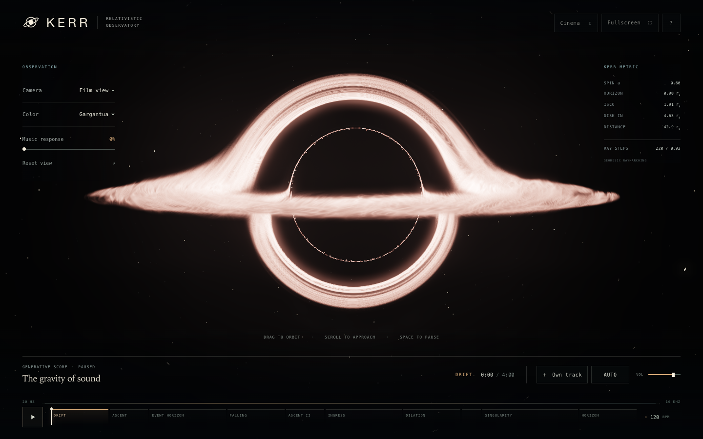
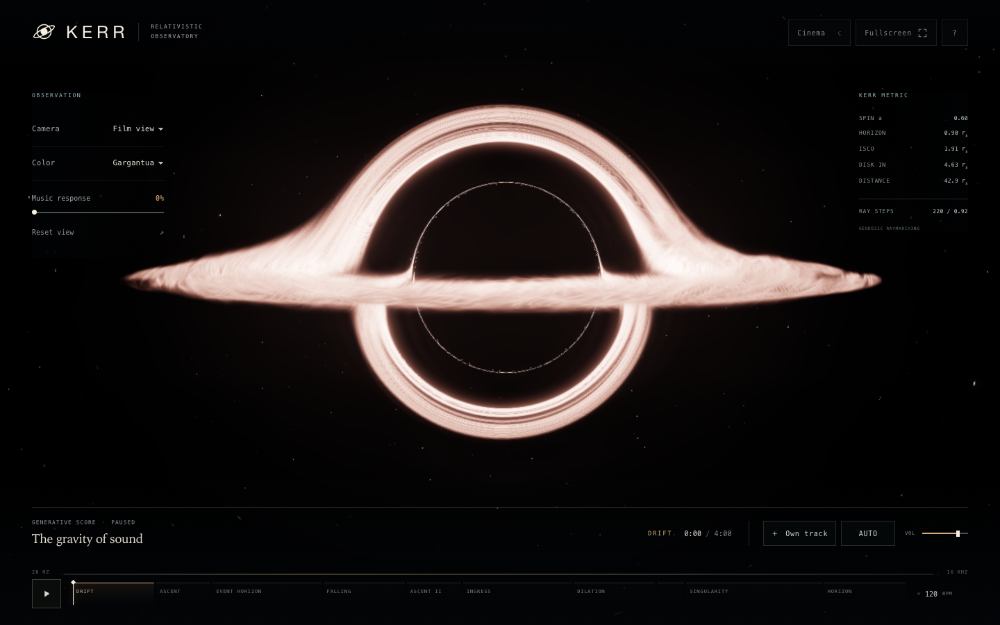
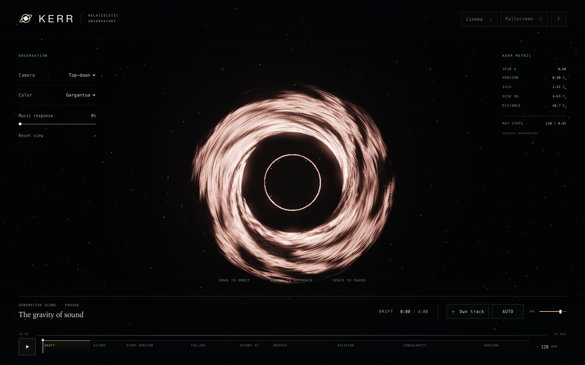
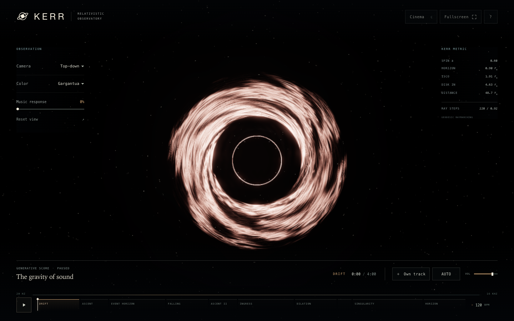

# Three.js r186 upgrade and visual review

Reviewed on 9 September 2026. This update improves the display pipeline around the existing volumetric raymarcher: darker sky and disk lanes, smoother luminous edges, and more controlled glow. It also fixes fullscreen controls and refreshes every README gallery capture.

## Release audit

| Dependency | Previous | Updated |
| --- | --- | --- |
| Three.js | 0.185.1 | 0.186.0 |
| esbuild | 0.28.1 | 0.28.2 |
| Wrangler | 4.114.0 | 4.130.0 |
| Node.js minimum | 20 | 22 |

[Three's r186 release](https://github.com/mrdoob/three.js/releases/tag/r186) includes substantial WebGPU, TSL and standard-material work. KERR's light bending and disk are custom WebGL shaders, so those material and lighting features do not automatically change this image. The [185 → 186 migration notes](https://github.com/mrdoob/three.js/wiki/Migration-Guide#185--186) were checked against the symbols this project uses.

Several release optimizations already matched KERR's implementation: [paired bilinear bloom samples](https://github.com/mrdoob/three.js/pull/34479), [depth-free bloom targets](https://github.com/mrdoob/three.js/pull/34036), and [direct clip-space fullscreen vertices](https://github.com/mrdoob/three.js/pull/33917). The improvements below are changes to KERR's own shaders and pass chain, made alongside the dependency upgrade. They are not new black-hole physics supplied by r186.

The vendored bundle is regenerated from 23 used exports and SHA-256 pinned. Wrangler now requires Node 22 or newer. Its Miniflare dependency still pins Sharp 0.35.2, so a scoped override selects [Sharp 0.35.4](https://github.com/lovell/sharp/releases/tag/v0.35.4), which patches the bundled image-library vulnerability. Remove that override when Miniflare itself pins a patched release. Native PNG encode/resize/decode and Wrangler's deployment dry run both pass with it; `npm audit` reports zero vulnerabilities.

## Rendering changes

- **Filtered highlight extraction.** Four source taps prefilter thin disk structures before the half-resolution bloom threshold. A luminance soft knee makes glow enter gradually and preserves the warm or cool input hue. This reduces brightness changes when a filament moves between source texels.
- **Separate glow scales.** Tight half-resolution bloom and quarter-resolution bloom retain local structure while feeding the broad eighth-resolution flare. The intermediate flare blur remains necessary: removing it produced faint lobes in the first visual comparison, so it was restored.
- **Correct display transfer.** The compositor uses Three's [sRGB transfer function](https://github.com/mrdoob/three.js/blob/r186/src/renderers/shaders/ShaderChunk/colorspace_pars_fragment.glsl.js) after ACES instead of an approximate gamma power. The linear segment near black restores separation between the sky, shadow and dark material lanes. Scene and bloom remain linear HDR, with one display conversion.
- **Spatial edge resolve.** A contrast-aware filter runs on display-encoded pixels, using the actual adaptive-resolution target size. Grain comes after it. There is no temporal history to leave trails during a drag, and isolated point highlights retain their magnitude.
- **Fullscreen triangle.** One oversized triangle replaces the two-triangle plane in the fullscreen passes, avoiding duplicate helper work along the old diagonal. This does not establish a measured frame-rate gain; the additional resolve and glow targets also have a cost.

The ray integrator, emitting/absorbing disk volume, camera controls and musical modulation remain the basis of the image. This is still an artist-directed approximation of the film treatment, as described in the [reference audit](INTERSTELLAR-REFERENCE.md).

## Controlled visual comparison

The previous implementation was captured from merged commit `e80832f`. Both versions used the same camera controls, Gargantua palette, 0% music response, score paused at 0:00, reduced-motion emulation, DPR 1, and the production quality policy. All comparison captures reached 220 ray steps at 0.92 scale on Chrome 152 / ANGLE Metal / Apple M2 Max. No shader, camera or quality uniforms were patched for these images.

| View | Before: r185 implementation | After: r186 and revised compositor |
| --- | --- | --- |
| Film, 1440 × 900 |  |  |
| Top-down, 1440 × 900 |  |  |

Open the images at full size to compare small edges. [Comparison provenance](../screenshots/r186-review/manifest.json) records the source builds, settings, GPU, image hashes and layout checks.

These frozen comparisons isolate the renderer upgrade. The README gallery was refreshed again after the foundation fixes below.

| Inspected view | Finding |
| --- | --- |
| Film | Smoother major arcs, darker sky, less milky glow around the disk. |
| Close passage | Filaments retain contrast; no new edge halo or broad-flare lobes. |
| Oblique | The same continuous disk remains readable through the inclined view. |
| Exact edge-on | The emitting volume remains visible in its plane; bloom does not replace its silhouette. |
| Top-down and underside | Dark lanes separate more clearly from bright layers; the small inner image is smoother but slightly fainter. |
| Phone Film, 390 × 844 | Complete framing and cleaner large arcs; the smallest higher-order image remains dotted. |

The phone limitation is sampling, not a missing drawn outline. Spatial antialiasing cannot recover paths that fall between rays. Very fine crosshatching also remains in some enlarged disk regions. A future quality improvement would need more ray samples or an integration/filtering strategy that preserves motion and fits mobile GPU budgets; this update does not claim to solve those limits.

## Layout and fullscreen verification

All seven [README gallery images](../README.md#-controls) were recaptured from the upgraded build at Ascent 0:35, Film view, Gargantua and 100% music response. Desktop interface/cinema, tablet portrait, phone portrait, phone landscape, small phone, and phone controls passed viewport bounds, overflow and visible-control hit checks, with no browser or WebGL errors. Their [capture manifest](../screenshots/capture-manifest.json) includes dimensions and hashes. Phone and tablet captures are Chrome viewport/touch emulation, not physical-device measurements.

The fullscreen button now follows `document.fullscreenElement` and `fullscreenchange`. Entry shows the expanded-view action; while fullscreen, the label becomes **Exit fullscreen**, its tooltip and accessible name agree, and the icon changes to inward corners. Browser-initiated exit and the F shortcut restore the entry action. Compact screens retain a 44-pixel icon target. Unsupported or rejected requests report the issue and leave the action consistent with the actual browser state.

## Regression coverage

The upgrade exposed an HTML packaging bug: JavaScript replacement tokens inside the new minified vendor bundle were being interpreted by `String.replace`. Build substitutions now use callbacks, preserving the exact payload bytes. A regression test checks byte-for-byte inclusion and parses both inline scripts, catching the blank-screen failure before browser startup.

- Six GPU tests compile the production shaders with the committed Three bundle and check sRGB dark patches, HDR highlight headroom, bloom hue and monotonicity, thin-filament phase stability, diagonal smoothing, isolated stars, grain black levels and unsigned-byte fallback.
- Five fullscreen browser tests exercise actual entry/exit, external exit, keyboard operation, compact hit targets and rejected requests.
- Existing camera, touch-drag star motion, audio, output detection, responsive layout, build, shader, smoke and offline PWA tests cover the rest of the application.
- `npm run check`, the production build, native Sharp image processing, `npm audit`, and `wrangler deploy --dry-run` pass.

The initial upgrade run passed 177 tests and cancelled one touch-motion test after its 90-second deadline; it reported no failed assertions. Re-running the unchanged complete smoke suite with the same deadline passed all 17 tests, including release, cancellation and capture loss in 30.7 seconds. The follow-up foundation review below adds coverage beyond those initial 178 checks.

The production document remains within the existing 640 KiB raw / 175 KiB gzip / 145 KiB Brotli budgets. Production CSS is now minified by the pinned esbuild version; the development stylesheet stays readable. The extra review images are documentation assets and are not shipped in that document. These checks establish rendering and behavior on the tested configurations, not sustained mobile performance or physical accuracy equivalent to DNGR.

## Foundation review

The follow-up review checked the renderer's target allocation and resize paths, fullscreen state, browser input, transport races, score scheduling, packaging and offline behavior. The fixes below were verified with tests that first failed against the previous behavior.

| Reproduced bug | Fix and regression coverage |
| --- | --- |
| Timeline keeps seeking after pointer capture is lost or the window loses focus. | Track the owning pointer, end the scrub on capture loss/blur, and ignore unrelated pointers. Actual Chrome touch gestures verify that the timeline holds at the last position after interruption. |
| Picking the same file after returning to the score does not fire another change event. | Clear the input after retaining its File. A real file-input test selects the same WAV twice, with a return to the score between selections. |
| An older score resume or pause rejection overwrites a newer playback request. | Context promise errors carry the transport request revision. Deferred-promise tests verify both source switching and rapid pause/resume. |
| A failed context resume marks the UI paused while the file's media timeline continues. | Pause the media element when the active request fails, keeping transport and visible state consistent. |
| A delayed timer schedules a missed passage's notes together. | Skip overdue score steps and schedule only the current lookahead window. The regression simulates a 12-second scheduling delay. |
| Returning to rendering replays stale visual impacts; simultaneous due events are processed backwards. | Expire effects more than half a second late and process due effects in their scheduled insertion order. Future events remain queued. |

The browser harness also cancels completed protocol request timers and explicitly closes its Chrome output pipes. Chrome helper processes can retain inherited stderr after the main browser exits; an observed stalled worker was traced to that pipe. Cleanup now releases it, without increasing test deadlines. The renderer review found no further target-disposal, color-conversion or resize regressions beyond the fixes already described above.

Final verification passed **187/187 tests**, with no failures, cancellations or skips. `npm run check`, the build, whitespace checks and Wrangler's deployment dry run passed; `npm audit` reported zero vulnerabilities. All seven final gallery images were visually inspected and their build/image hashes and control bounds verified. The final document is 638.8 KiB raw, 170.3 KiB gzip and 141.7 KiB Brotli.
